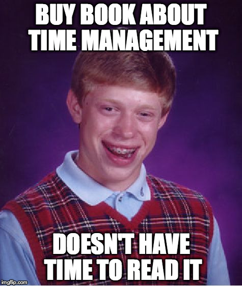
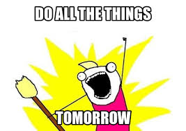
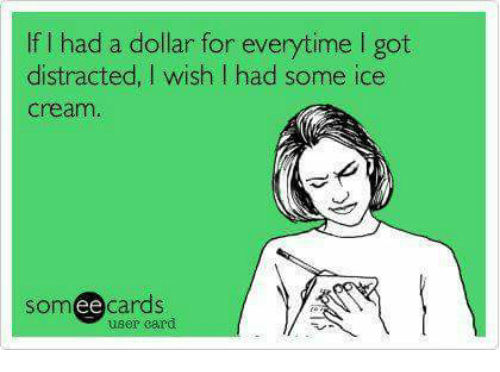
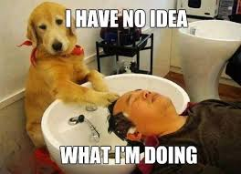

# Diary of a Newbie Developer

Beating Procrastination 
& 
Boosing Productivity    

---

## A bit about me

- A newbie software engineer |
- Graduate Engineer in Boeing | 
- Software Engineer at Red Hat |
- Lead Org for NodeGirls Brisbane |

Note: 
up until my role in boeing, everyhting was a little different. in uni you are spoon fed quite a lot,
even though coming from high school it may not seem like it. Deadlines are still very clear, 
and there is a clearly defined timeline of when u should be doing what. I mean its upto you
to skip a lecture, but then you know u have to come back to it or learn that info at some point before 
the next tute or exam. 
But with both red hat and node girls, i was quite a lot more free in terms of time management. 
It felt like moving out of your parents house at 18 feels. like you suddenly realise that
you can eat icecream for breakfast. 

---

# Procrastination

### The icecream-for-breakfast of my time management

Note:
There are many reasons why people procrastinate. 
I know one of the big reasons why i procrastinate is a fear of failure.
It can be a lack of motivation. 
but especially early on in my self managed learning environment when i was used to being supervised more

its something that you know you shouldn't be doing, but it feels good so you do it and then
you judge yourself. 
It hindered my productivity

---

#### Tips to improve Time Management & Productivity 

Note: 

and i've gotten a lot of advice in the months since that time that i've taken on.
And i'm here to share what i've tried, whats worked and what hasnt.
Often i find that figuring out what to do is the first and most crucial step towards actually
doing that something. And these tools help with that, plus
you get better at time management, and a direct result of that is increased productivity

---

# Use a Task Organiser

---

## trello

- To-do lists |
- Personal reminders |
- Delegation |
- Prioritisation | 

Note:
delegation is a lifesavers for NodeGirls boards,
we even used it for moving house
Prioritisation is a life saver for myself 
use different boards for different topics

---

# Prioritise

---

## Eisenhower technique

- Urgent && Important |
- Important && !(Urgent) |
- !(Important) && Urgent |
- !(Important) && !(Urgent) |

Note:
bible of time management and prioritisation
Do, Plan, Delegate, Delete

---

# Be in charge of your time

Note:
Now that you have the items in your todo list, we need to look at when you can and need to do them

---

## Make friends with your calendar app

- Put every little thing in your calendar |
- Do some planning prep before the week starts |
- Look at the plan for the day before you do anything else |

Note:
Even a short phone call
get an overview of what you have going so you have a general idea of how to tackle the week.
If you look at emails before you look at your tasks, you get distracted and it can start to get overwhelming.

---

# Avoid Distractions

- Put the phone away |
- Turn off non-urgent notifications |
- Keep a paper pad for notes (when you can) |
- Close all unnecessary tabs |

Note:
this ones probably the most preachy one, and also quite hypocritical because i dont always follow it
Especially with NodeGirls stuff ill often have to stay on top of my notifications.
but its so hard to not get distracted by all the other pop ups and flashing lights and shiny things.
if you have somethign you need to write down in trello, if u can, write it down on a notepad first.
the fact that trello is on a browser or a phone can cause some annoyances

---

---
# Take a break

- Go for a Walk |
- Journal |
- Change of context |
- Work on a different task |

Note:
maybe read emails? It can work wonders to write to yourself

---

# Take care of yourself!

---

- Make sure you are getting enough exercise |
- Eat protein & limit sugars to keep your mind alert |

Note:
Im not a doctor, but im sure most people would tell you this from personal experience

---

# Summary

---

### Questions?

 

@fa[twitter gp-contact](@AnweshaChatte12)

@fa[github gp-contact](anchat1990)

@fa[medium gp-contact](@anweshachatterjee)

@fa[linkedin gp-contact](/chatterjeeanwesha)

---

# Thank you!

